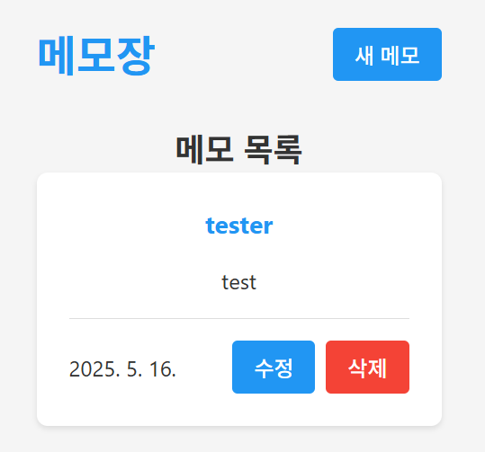
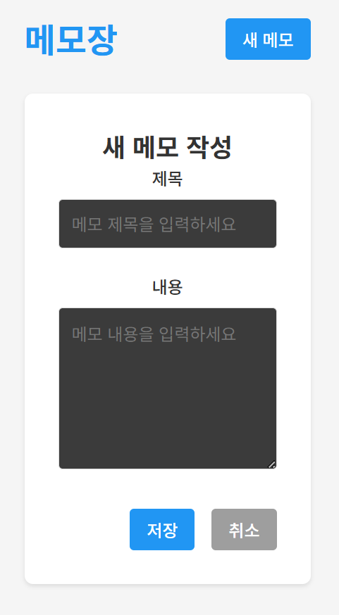
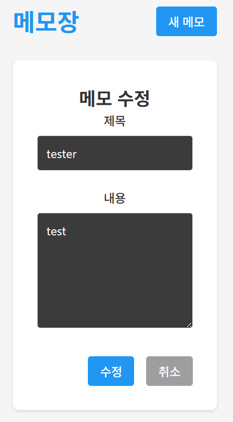

# Memo Web Application 

---

- 이 프로젝트는 **Spring Boot와 React(Vite + TypeScript)**를 활용한 현대적인 메모 웹 애플리케이션입니다.

<h1>Modern Memo Web Application using Spring Boot and React v1.0</h1>

---

> **SeSAC**  
> **개발기간 : 2025.05.13 - 2025.05.19**

# 개발자 

---

|                              **이상준**                               |
| :-------------------------------------------------------------------: |
|  |
|               [@namung08](https://github.com/namung08)                |
|                    안산대학교 컴퓨터 정보학과 졸업                    |

# 프로젝트 소개 

---

- **메모 관리** : 사용자가 일상적인 메모를 효율적으로 관리할 수 있는 기능을 제공합니다.
- **상태 관리** : 메모의 작성/수정 상태를 쉽게 관리할 수 있습니다.
- **데이터 저장** : MariaDB를 활용하여 사용자의 메모 데이터를 안전하게 저장합니다.
- **반응형 디자인** : 모든 디바이스에서 최적화된 사용자 경험을 제공합니다.
- **컨테이너화** : Docker Compose를 활용하여 개발 및 배포 환경을 컨테이너화했습니다.
- **Cursor 활용** : Cursor를 통해 프론트엔드 페이지 및 Docker 설정을 구성했습니다.
- **배포 최적화** : 초기 Nginx 배포 시도 및 CORS 문제 해결 과정을 통해 실제 운영 환경에서 발생할 수 있는 문제를 해결했습니다.

# 시작 가이드 

---

- **프로그래밍 언어** : [Java](https://www.java.com/), [TypeScript](https://www.typescriptlang.org/)
- **프레임워크** : [Spring Boot](https://spring.io/projects/spring-boot), [React 19](https://react.dev/)
- **빌드 도구** : [Maven](https://maven.apache.org/), [Vite](https://vitejs.dev/)
- **패키지 매니저** : [npm](https://www.npmjs.com/)
- **데이터베이스** : [MariaDB](https://mariadb.org/)
- **컨테이너화** : [Docker](https://www.docker.com/), [Docker Compose](https://docs.docker.com/compose/)
- **사용 툴** : [VS Code](https://code.visualstudio.com/), [Cursor](https://cursor.sh/)

```bash
git clone https://github.com/namung08/memo_web_application.git
cd memo_web_application
docker-compose up -d
```

# 기술 스택 📚

---

<div align="center">

### Environment


### Config


### Development


### Database


### Container


### Communication


</div>

# 화면 구성 

---

| **메인 화면**             | **메모 작성**               | **메모 수정**             |
| ------------------------- | --------------------------- | ------------------------- |
|  |  |  |

# 주요 기능 

---

## ⭐️ 메모 관리 기능

- 새로운 메모 작성
- 기존 메모 수정
- 메모 삭제

## ⭐️ 상태 관리 기능

- 메모 작성/수정 상태 관리
- 진행 상태에 따른 시각적 표시

## ⭐️ 데이터 저장 기능

- MariaDB를 활용한 데이터 영구 저장
- 페이지 새로고침 시에도 데이터 유지

## ⭐️ 컨테이너화 기능

- Docker Compose를 활용한 개발 및 배포 환경 컨테이너화
- Cursor를 통한 프론트엔드 페이지 및 Docker 설정 구성

## ⭐️ 배포 최적화 기능

- 초기 Nginx 배포 시도 및 CORS 문제 해결
- React 페이지를 정적 파일로 빌드하여 Spring Boot 애플리케이션에서 서빙

# 프로젝트 구조 

---

````text

Ctrl+K to generate a command
# Todo List 

---

- 이 프로젝트는 **React와 TypeScript**를 활용한 현대적인 Todo List 애플리케이션입니다.

<h1>Modern Todo List Application using React and TypeScript v1.0</h1>

---

> **SeSAC**
> **개발기간 : 2025.04.25**

# 개발자 

---

|                              **이상준**                               |
| :-------------------------------------------------------------------: |
|  |
|               [@namung08](https://github.com/namung08)                |
|                    안산대학교 컴퓨터 정보학과 졸업                    |

# 프로젝트 소개 

---

- **할 일 관리** : 사용자가 일상적인 할 일을 효율적으로 관리할 수 있는 기능을 제공합니다.
- **상태 관리** : 할 일의 완료/미완료 상태를 쉽게 관리할 수 있습니다.
- **데이터 저장** : React Cookie를 활용하여 사용자의 할 일 데이터를 안전하게 저장합니다.
- **반응형 디자인** : 모든 디바이스에서 최적화된 사용자 경험을 제공합니다.

# 시작 가이드 

---

- **프로그래밍 언어** : [TypeScript](https://www.typescriptlang.org/)
- **프레임워크** : [React 19](https://react.dev/)
- **빌드 도구** : [Vite](https://vitejs.dev/)
- **패키지 매니저** : [npm](https://www.npmjs.com/)
- **사용 툴** : [VS Code](https://code.visualstudio.com/)

```bash
git clone https://github.com/namung08/todo_list.git
cd todo_list
npm install
npm run dev
````

# 기술 스택 📚

---

<div align="center">

### Environment


### Config


### Development


### Communication


</div>

# 화면 구성 

---

| **메인 화면**             | **할 일 추가**          |
| ------------------------- | ----------------------- |
|  |  |

| **메인 쿠키**                     | **추가 후 쿠키키**            |
| --------------------------------- | ----------------------------- |
|  |  |

# 주요 기능 

---

## ⭐️ 할 일 관리 기능

- 새로운 할 일 추가
- 기존 할 일 수정
- 할 일 삭제

## ⭐️ 상태 관리 기능

- 할 일 완료/미완료 상태 토글
- 진행 상태에 따른 시각적 표시

## ⭐️ 데이터 저장 기능

- React Cookie를 활용한 데이터 영구 저장
- 페이지 새로고침 시에도 데이터 유지

# 프로젝트 구조 

---

```
memo_web_application/
├── front/
│ ├── src/
│ │ ├── components/ # 컴포넌트
│ │ ├── assets/ # 이미지 등 정적 자원
│ │ ├── App.tsx # 메인 애플리케이션 컴포넌트
│ │ ├── App.css # 애플리케이션 스타일
│ │ ├── main.tsx # 진입점
│ │ ├── index.css # 전역 스타일
│ │ └── vite-env.d.ts # Vite 타입 정의
│ ├── public/ # 정적 파일
│ ├── index.html # 메인 HTML 파일
│ └── vite.config.ts # Vite 설정 파일
├── back/
│ ├── src/
│ │ ├── main/
│ │ │ ├── java/
│ │ │ │ └── com/
│ │ │ │ └── memo/
│ │ │ │ └── back/
│ │ │ │ ├── infrastructure/ # 인프라스트럭처 계층 (서버에 필요한 설정 등 파일 위치치)
│ │ │ │ ├── exception/ # 예외 내용을 저장하기 위한 도메인인
│ │ │ │ ├── web/ # 웹 계층
│ │ │ │ ├── memo/ # 메모 도메인
│ │ │ │ └── BackApplication.java # 메인 애플리케이션
│ │ │ └── resources/
│ │ │ └── application.properties # 애플리케이션 설정
│ │ └── test/ # 테스트
│ └── pom.xml # Maven 설정 파일
├── docker-compose.yml # Docker Compose 설정 파일
└── README.md # 프로젝트 설명 파일
```
